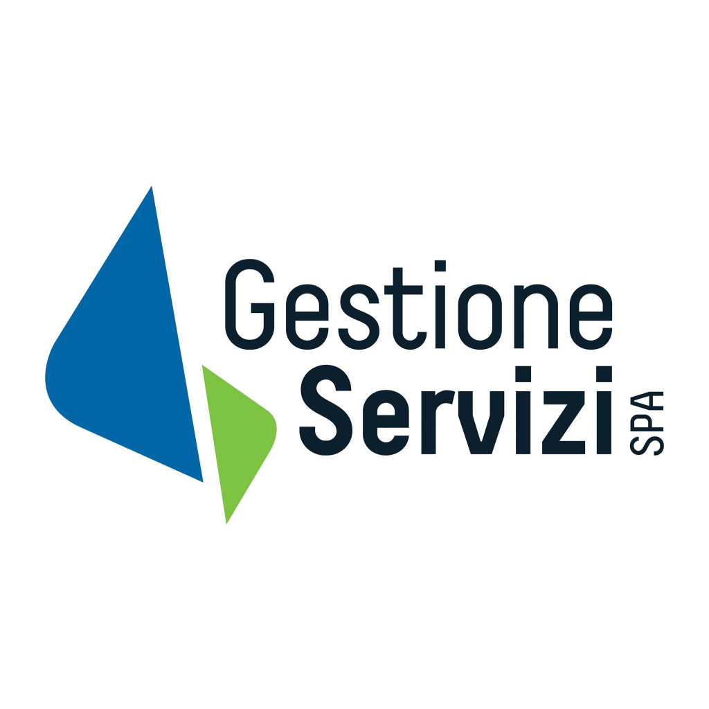

    

    
    

## 🕐 La nostra storia

### Da oltre 25 anni, punto di riferimento nel settore della Pubblica Amministrazione

Opera oggi nel settore della Fiscalità degli Enti Locali e nella realizzazione di soluzioni digitali per la Pubblica Amministrazione. Grazie alle proprie soluzioni, tecnologicamente avanzate, è in grado di semplificare il rapporto tra cittadino-Ente. Con una vasta esperienza nel settore tecnico ed informatico, Gestione Servizi offre un’ampia gamma di soluzioni e servizi di alto valore a supporto ai propri clienti, collaborando on-Site e fornendo assistenza tecnica specializzata continua. Grazie alla competenza acquisita nei numerosi anni di esperienza nell'ambito della PA, la società ha maturato una notevole abilità nell’analisi delle esigenze, nella definizione dei processi, nello sviluppo di software e nella consulenza informatica. Il vero successo deriva da un’attenta analisi ed interpretazione delle esigenze dei propri clienti e stakeholders, fattore che permette di individuare in maniera efficace la soluzione più indicata utilizzando le più aggiornate tecnologie.

## 🔍 Visione

La nostra vision è diventare il partner di riferimento per enti pubblici nella ricerca di soluzioni innovative. Ci impegniamo a supportare le organizzazioni nel raggiungimento degli obiettivi di efficientamento e ottimizzazione delle attività, offrendo strumenti digitali che semplificano e migliorano i processi operativi

## 🎯 Missione

🌍 Innovazione  
Diamo alla Pubblica Amministrazione gli strumenti digitali più avanzati per esprimere al massimo il proprio potenziale, semplificando processi e servizi in modo smart ed efficace.  
📄 Paperless  
Digitalizziamo atti e documenti sin dalla loro creazione, garantendo invio dematerializzato, archiviazione sicura e una ricerca immediata tramite parole chiave, metadati e indici intelligenti.  
👥 Citizen Relationship Management  
Introduciamo soluzioni strategiche che rendono le politiche pubbliche realmente inclusive ed efficienti, migliorando la relazione tra enti e cittadini.  
☁️ Cloud First  
Promuoviamo l’adozione di infrastrutture cloud sicure e affidabili, offrendo servizi digitali scalabili, autonomi ed efficienti per una PA sempre più moderna e connessa.

## 🤝 I nostri valori

🔍 Trasparenza  
Essere partner tecnologico della Pubblica Amministrazione significa garantire sempre chiarezza e accessibilità. Il nostro obiettivo è offrire agli Enti un quadro chiaro e completo della situazione, favorendo decisioni informate e consapevoli.  
🎓 Esperienza  
Con oltre vent’anni di esperienza sul campo, abbiamo collaborato con realtà diverse, acquisendo competenze specifiche in numerosi ambiti della PA. Questo know-how consolidato ci permette di affrontare e risolvere con efficacia ogni sfida.  
👥 Relazioni  
Ascoltare le esigenze della Pubblica Amministrazione è il primo passo per costruire soluzioni realmente efficaci. Le nostre relazioni con gli Enti sono basate sulla fiducia e sulla comprensione, per tradurre i bisogni in strumenti digitali efficienti.  
🚀 Innovazione  
Siamo il motore che permette ai nostri clienti di rimanere tecnologicamente competitivi. Investiamo costantemente in ricerca e sviluppo, garantendo soluzioni all’avanguardia che rispondano alle sfide del futuro.

## 🧾 Contatti

📍 Indirizzo: [Viale Agostino Dipierro, 66 - Noicattaro (BA) - Puglia - Italia](https://www.google.com/maps/place/Gestione+Servizi+Spa/)

📄 P. IVA: 05512020727

📞 Telefono: [080 350 22 10](tel:0803502210)

📧 Email: [info@gestioneservizispa.it](mailto:info@gestioneservizispa.it)

## 📱 Social

[![LinkedIn](https://img.shields.io/badge/LinkedIn-%230077B5.svg?logo=data:image/svg%2bxml;base64,PHN2ZyB4bWxucz0iaHR0cDovL3d3dy53My5vcmcvMjAwMC9zdmciIHhtbG5zOnhsaW5rPSJodHRwOi8vd3d3LnczLm9yZy8xOTk5L3hsaW5rIiB2aWV3Qm94PSIwLDAsMjU2LDI1NiIgd2lkdGg9IjUwcHgiIGhlaWdodD0iNTBweCIgZmlsbC1ydWxlPSJub256ZXJvIj48ZyBmaWxsPSIjZmZmZmZmIiBmaWxsLXJ1bGU9Im5vbnplcm8iIHN0cm9rZT0ibm9uZSIgc3Ryb2tlLXdpZHRoPSIxIiBzdHJva2UtbGluZWNhcD0iYnV0dCIgc3Ryb2tlLWxpbmVqb2luPSJtaXRlciIgc3Ryb2tlLW1pdGVybGltaXQ9IjEwIiBzdHJva2UtZGFzaGFycmF5PSIiIHN0cm9rZS1kYXNob2Zmc2V0PSIwIiBmb250LWZhbWlseT0ibm9uZSIgZm9udC13ZWlnaHQ9Im5vbmUiIGZvbnQtc2l6ZT0ibm9uZSIgdGV4dC1hbmNob3I9Im5vbmUiIHN0eWxlPSJtaXgtYmxlbmQtbW9kZTogbm9ybWFsIj48ZyB0cmFuc2Zvcm09InNjYWxlKDUuMTIsNS4xMikiPjxwYXRoIGQ9Ik00MSw0aC0zMmMtMi43NiwwIC01LDIuMjQgLTUsNXYzMmMwLDIuNzYgMi4yNCw1IDUsNWgzMmMyLjc2LDAgNSwtMi4yNCA1LC01di0zMmMwLC0yLjc2IC0yLjI0LC01IC01LC01ek0xNywyMHYxOWgtNnYtMTl6TTExLDE0LjQ3YzAsLTEuNCAxLjIsLTIuNDcgMywtMi40N2MxLjgsMCAyLjkzLDEuMDcgMywyLjQ3YzAsMS40IC0xLjEyLDIuNTMgLTMsMi41M2MtMS44LDAgLTMsLTEuMTMgLTMsLTIuNTN6TTM5LDM5aC02YzAsMCAwLC05LjI2IDAsLTEwYzAsLTIgLTEsLTQgLTMuNSwtNC4wNGgtMC4wOGMtMi40MiwwIC0zLjQyLDIuMDYgLTMuNDIsNC4wNGMwLDAuOTEgMCwxMCAwLDEwaC02di0xOWg2djIuNTZjMCwwIDEuOTMsLTIuNTYgNS44MSwtMi41NmMzLjk3LDAgNy4xOSwyLjczIDcuMTksOC4yNnoiPjwvcGF0aD48L2c+PC9nPjwvc3ZnPg==&logoColor=white)](https://www.linkedin.com/company/gestione-servizi-spa/)

